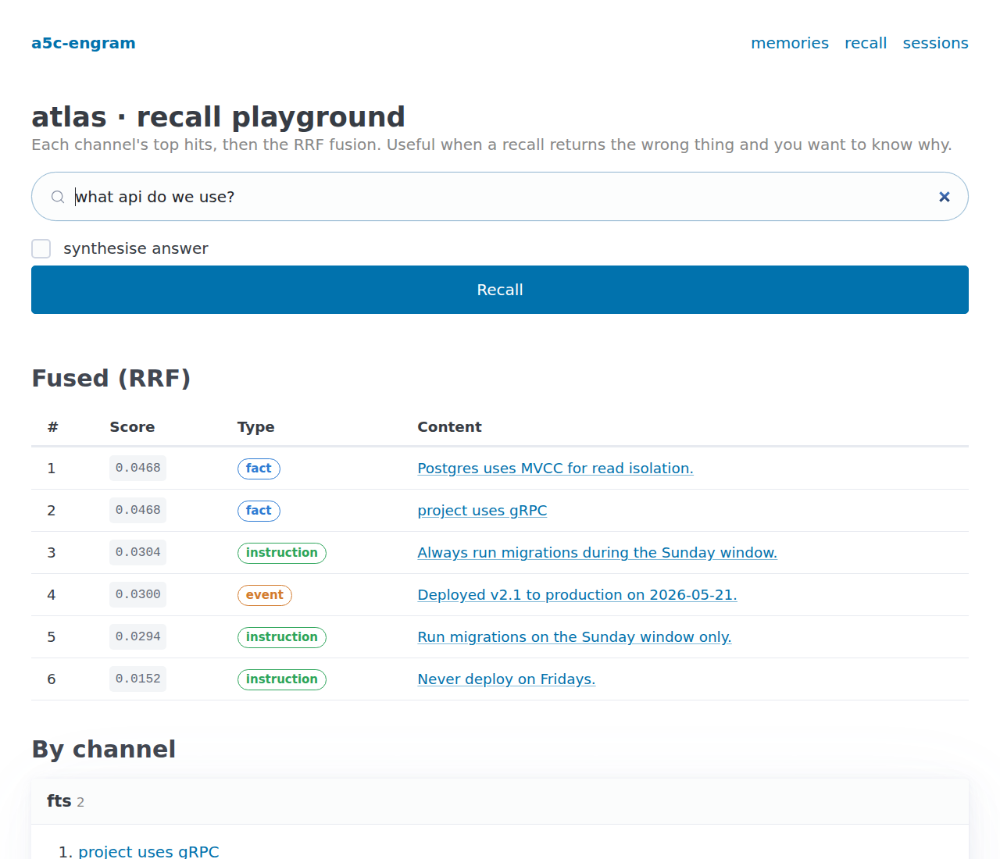
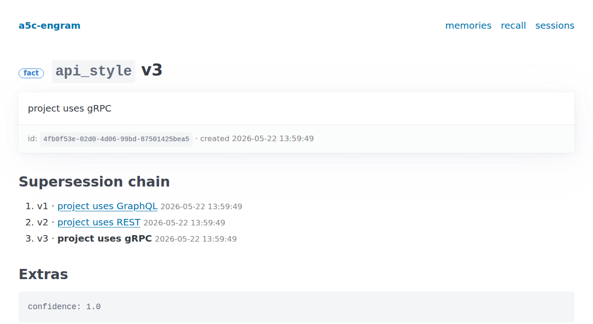

# a5c-engram

Self-hostable memory for Python agents, with a UI for browsing what got stored.

Default config is fully local. SQLite for storage, a small ONNX embedder for vectors, no API keys needed. There are paid options (OpenAI, Voyage, Anthropic) if you want them.

```python
from a5c_engram import Profile

p = Profile.open("my-agent")

# Pull memories out of a conversation.
p.ingest([
    {"role": "user", "content": "My name is Alice."},
    {"role": "user", "content": "We deploy every Thursday at 14:00 UTC."},
])

# Or write one directly.
p.remember("the project uses GraphQL", type="fact", topic="api_style")
p.remember("the project uses gRPC",    type="fact", topic="api_style")

# Then ask.
print(p.recall("what api do we use?").hits[0].memory.content)
# "the project uses gRPC"
# (GraphQL is still in the db but marked superseded so it stops
# showing up in recall.)
```

## Install

```bash
uv add a5c-engram                     # core + local embedder
uv add 'a5c-engram[paid]'             # OpenAI / Voyage embedders
uv add 'a5c-engram[anthropic]'        # real LLM extraction
```

First call downloads a 120MB ONNX model (`BAAI/bge-small-en-v1.5`) into `~/.cache/fastembed`. After that everything runs offline.

## UI

```bash
uv run python -m a5c_engram.server
# api at  http://localhost:8000/api/
# ui  at  http://localhost:8000/ui
```

The recall playground. Type a query, see what each channel returned, see the fused result underneath.



Memory detail page with the supersession chain. Here `api_style` got rewritten twice: GraphQL, then REST, then gRPC.



More screenshots (profiles index, memory list with filters) live in [`docs/screenshots/`](docs/screenshots/).

Forget buttons are off by default. Set `A5C_ENGRAM_UI_WRITES=1` if you want them.

## How it works

A memory is one of four kinds: fact, event, instruction, or task. Each one has a content string. Facts and instructions can also carry a `fact_key` topic slug.

Ingest pulls memories out of a conversation. A regex pre-pass catches the cheap stuff (dates, numeric assignments, "always X", "my name is Y", etc) without calling the LLM. The LLM handles the rest.

Every non-task memory also gets a few short paraphrases from the LLM. Those go into the FTS index and into the embedding, so the same memory is reachable from a few different lexical shapes.

When a new fact lands under an existing `fact_key`, the older version is marked superseded and stops appearing in recall. The chain stays in the database so you can inspect it.

Recall runs six channels in parallel:

1. FTS over content + paraphrases.
2. Exact `fact_key` lookup.
3. FTS over the raw ingested messages.
4. Vector similarity.
5. Time-window match for "yesterday" or "last 24 hours" style queries.
6. HyDE: embed the LLM's hypothetical answer and search for that.

Results merge with Reciprocal Rank Fusion. Temporal queries skip HyDE because we already know the answer shape.

## Embedders

| Embedder | What | Install |
|---|---|---|
| `FastEmbedder` (default) | local, CPU only, 120MB ONNX | base install |
| `OpenAIEmbedder` | API, `text-embedding-3-small` | `[paid]` + `OPENAI_API_KEY` |
| `VoyageEmbedder` | API, `voyage-3` | `[paid]` + `VOYAGE_API_KEY` |
| `BgeSmallEmbedder` | sentence-transformers | `[sentence-transformers]` |
| `FakeEmbedder` | hash-based stub for tests | base install |

Pass `embedder=` to `Profile.open()`, or set `A5C_ENGRAM_EMBEDDER` to pick by name.

LLMs work the same way. `LLMAdapter` has four methods (`extract`, `paraphrase`, `hyde`, `synthesise`). `AnthropicLLM` is included; copy that file to add OpenAI, Ollama, etc.

## Examples

Five demos in [`examples/`](examples/):

- `chatbot_demo.py`: no setup, runs against the fakes, walks through everything.
- `real_llm_demo.py`: wire up Anthropic for real extraction.
- `real_embedder_demo.py`: fake vs fastembed vs paid APIs on the same corpus.
- `integrate_fastapi.py`: mount a Profile and the UI in your own FastAPI app.
- `grdt_atlas_demo.py`: backfill from a Redis stream.
